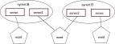

The Structure of a Wordnet
==========================
**Wordnet** is an online lexicon which is organized by concepts. 

The basic unit of a wordnet is Synonym set (**Synset**), a group of words that all refer to the 
same concept. Words and synsets are linked by means of conceptual-semantic relations to form the 
structure of wordnet. 

Words, Senses, and Synsets
--------------------------
We all know that **words** are the basic building blocks of languages, a word is built up with two parts, 
its form and its meaning, but in natural languages, the word form and word meaning are not in an elegant 
one-to-one match, one word form may connect to many different meanings, so hereforth, we need **senses**, 
to work as the unit of word meanings, for example, the word *bank* has at least two senses:

1. bank\ :sup:`1`\: financial institution, like *City Bank*;
2. bank\ :sup:`2`\: sloping land, like *river bank*;

Since **synsets** are group of words with the same senses, bank\ :sup:`1`\ and bank\ :sup:`2`\ are members of 
two different synsets, although they have the same word form.

On the other hand, different word forms may also convey the same senses, such as *cab* and *taxi*, 
these word forms with the same senses are grouped together into one synset.

    Figure: relations between word, sense and synset

Synset Relations
----------------
In wordnet, synsets are linked with each other to form various kinds of relations. For example, if 
the concept expressed by a synset is more general than a given synset, then it is in a *hypernym* relation 
with the given synset. As shown in below figure, the synset with *car*, *auto* and *automobile* as its 
member is the *hypernym* of the other synset with *cab*, *taxi* and *hack*. Such relation which is built on 
the synset level is categorized as synset relations.

.. figure:: images/synset-synset.svg
    :width: 400px
    :height: 200px
    :alt: example of synset relation

    Figure: example of synset relation

Sense Relations
---------------

Some relations in wordnet are also built on sense level, which can be further devided into two types, 
relations that link sense with other sense, and relations that link sense with other synset.

.. note::  Synset relations and sense relations are not mutually exclusive, one relation can be 
    both a synset relation and a sense relation under specific circumstances.

**Sense-Sense**

Sense to sense relations emphasize the cnnections between different senses, especially when dealing 
with morphologically related words. For example, *behavioral* is the adjective to the noun *behavior*, 
which is known as in the *pertainym* relation with *behavior*, however, such relation doesn't exist between 
*behavioral* and *conduct*, which is a synonym of *behavior* and is in the same synset. Here *pertainym* 
is a sense-sense relation.

    Figure: example of sense-sense relation

**Sense-Synset**

Sense-synset relations connect a particular sense with a synset. For example, *cursor* is a term in the 
*computer science* discipline, in wordnet, it is in the *Has Domain Topic* relation with the 
*computer science* synset, but *pointer*, which is in the same synset with *cursor*, is not a term, thus 
has no such relation with *computer science* synset.

    Figure: example of sense-synset relation

Other Information
-----------------

Definition

+--------------+-----------+
| text         | str       |
+--------------+-----------+
| language     | str       |
+--------------+-----------+
| source_sense | str       |
+--------------+-----------+

Example

+-------------+-----------+
| text        | str       |
+-------------+-----------+
| language    | str       |
+-------------+-----------+

Metadata

+------------------+-----------+-----------+
| contributor      | Optional  |  str      |
+------------------+-----------+-----------+
| coverage         | Optional  |  str      |
+------------------+-----------+-----------+
| creator          | Optional  |  str      |
+------------------+-----------+-----------+
| date             | Optional  |  str      |
+------------------+-----------+-----------+
| description      | Optional  |  str      |
+------------------+-----------+-----------+
| format           | Optional  |  str      |
+------------------+-----------+-----------+
| identifier       | Optional  |  str      |
+------------------+-----------+-----------+
| publisher        | Optional  |  str      |
+------------------+-----------+-----------+
| relation         | Optional  |  str      |
+------------------+-----------+-----------+
| rights           | Optional  |  str      |
+------------------+-----------+-----------+
| source           | Optional  |  str      |
+------------------+-----------+-----------+
| subject          | Optional  |  str      |
+------------------+-----------+-----------+
| title            | Optional  |  str      |
+------------------+-----------+-----------+
| type             | Optional  |  str      |
+------------------+-----------+-----------+
| status           | Optional  |  str      |
+------------------+-----------+-----------+
| note             | Optional  |  str      |
+------------------+-----------+-----------+
| confidence       | Optional  |  float    |
+------------------+-----------+-----------+